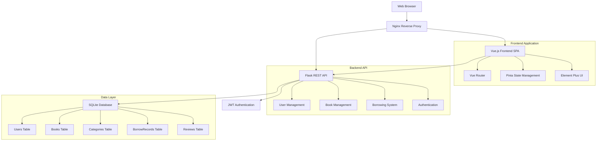
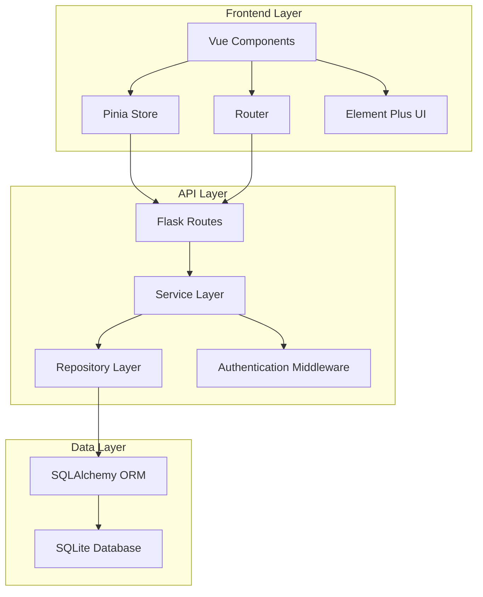
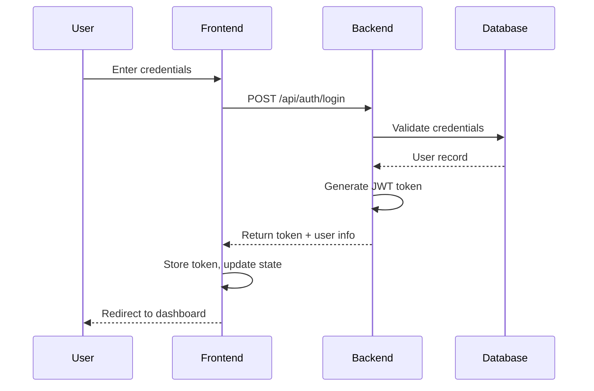
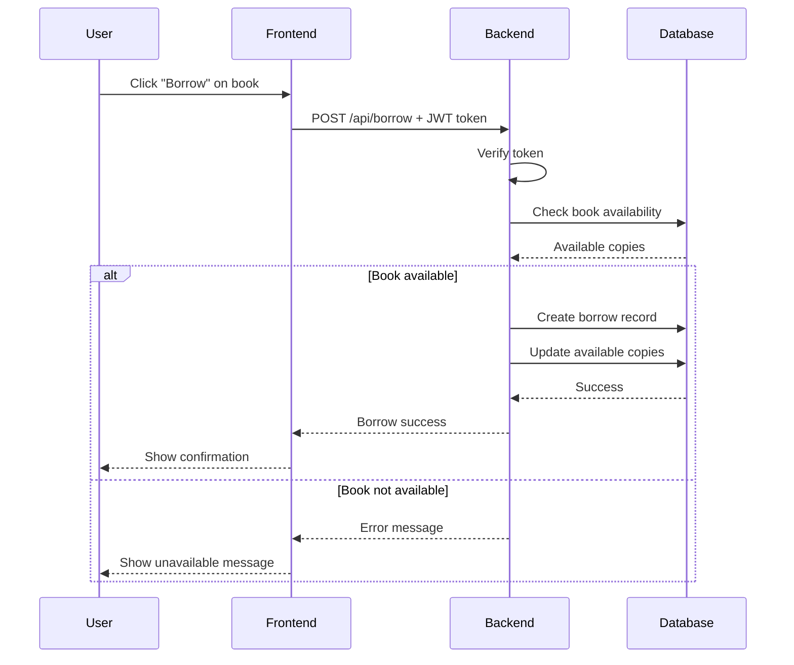
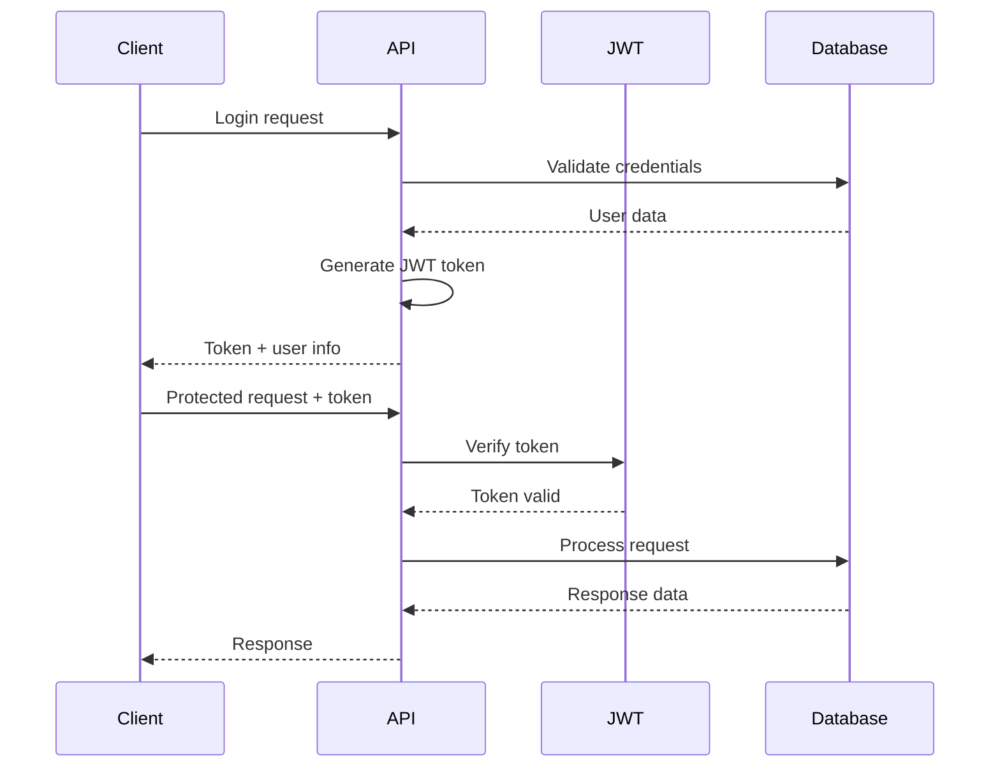
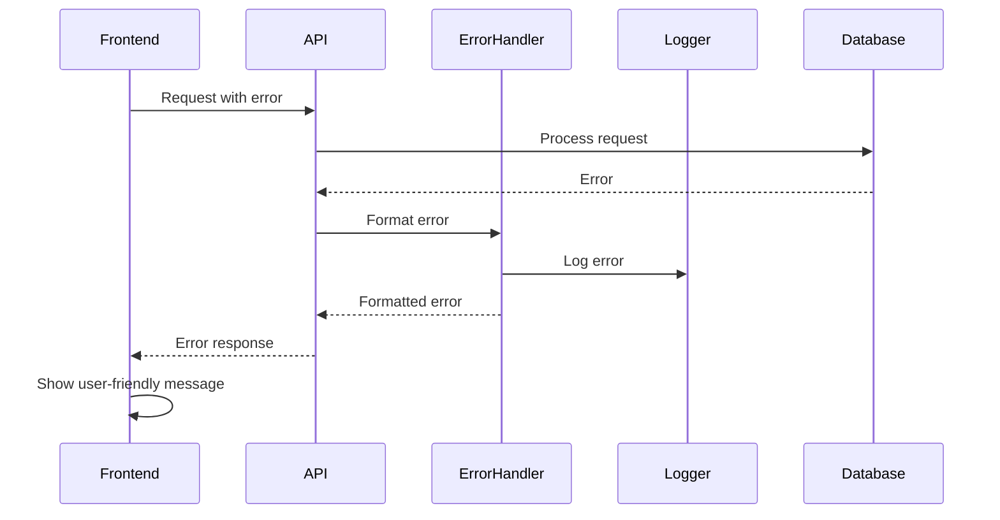

# 图书管理系统 Fullstack Architecture Document

## Introduction

This document outlines the complete fullstack architecture for 图书管理系统, including backend systems, frontend implementation, and their integration. It serves as the single source of truth for AI-driven development, ensuring consistency across the entire technology stack.

This unified approach combines what would traditionally be separate backend and frontend architecture documents, streamlining the development process for modern fullstack applications where these concerns are increasingly intertwined.

### Starter Template or Existing Project

N/A - Greenfield project. We will build this application from scratch using the technology stack specified in the PRD.

### Change Log

| Date | Version | Description | Author |
|------|---------|-------------|---------|
| 2025-12-09 | 1.0 | Initial architecture document creation | Winston (Architect) |

## High Level Architecture

### Technical Summary

This is a modern fullstack web application employing a client-server architecture with Vue.js frontend, Flask REST API backend, and SQLite database for data persistence. The system is designed for small to medium-sized libraries requiring a cost-effective, easy-to-maintain solution. The architecture prioritizes simplicity and rapid development while maintaining scalability for future growth. Security is implemented through JWT-based authentication, with clear separation between user and administrative roles.

### Platform and Infrastructure Choice

**Platform:** Self-hosted Linux server (Ubuntu 20.04 LTS)

**Key Services:**
- Nginx for reverse proxy and static file serving
- Gunicorn WSGI server for Python Flask application
- SQLite file-based database for simplicity and low maintenance
- Optional Redis for session storage and caching (future enhancement)

**Deployment Host and Regions:** On-premise server or cloud VM provider (AWS EC2, Azure VM, or DigitalOcean Droplet) in user's preferred region

### Repository Structure

**Structure:** Monorepo with clear separation between frontend and backend

**Monorepo Tool:** npm workspaces for shared package management

**Package Organization:**
- `/frontend` - Vue.js SPA application
- `/backend` - Flask REST API application
- `/shared` - TypeScript interfaces and shared utilities
- `/infrastructure` - Deployment and infrastructure scripts

### High Level Architecture Diagram



### Architectural Patterns

- **RESTful API Pattern**: Standard HTTP methods with clear resource endpoints - _Rationale_: Simple, well-understood pattern enabling easy frontend integration
- **JWT Authentication Pattern**: Stateless authentication with tokens - _Rationale_: Scales well, enables mobile app support, reduces server memory usage
- **Component-Based Frontend**: Vue 3 composition API with reusable components - _Rationale_: Maintainability, code reuse, and consistent user experience
- **Repository Pattern**: Abstract data access layer in backend - _Rationale_: Enables testing and future database migration flexibility
- **MVC Pattern**: Model-View-Controller for backend structure - _Rationale_: Clear separation of concerns and standard Flask pattern
- **State Management Pattern**: Pinia for centralized state - _Rationale_: Predictable state updates, time-travel debugging
- **API Gateway Pattern**: Nginx as reverse proxy - _Rationale_: Security, SSL termination, static file serving

## Tech Stack

This is the DEFINITIVE technology selection for the entire project. All development must use these exact versions.

### Technology Stack Table

| Category | Technology | Version | Purpose | Rationale |
|----------|------------|---------|---------|-----------|
| Frontend Language | JavaScript | ES2020+ | Frontend development | Modern JavaScript features, excellent browser support |
| Frontend Framework | Vue.js | 3.3.0 | Reactive UI framework | Composition API, excellent performance, easy learning curve |
| UI Component Library | Element Plus | 2.4.0 | Pre-built UI components | Rich component library, Vue 3 compatible, Chinese documentation |
| State Management | Pinia | 2.1.0 | Frontend state management | Official Vue state management, simple API |
| Backend Language | Python | 3.9+ | Backend development | Mature ecosystem, excellent for rapid development |
| Backend Framework | Flask | 2.3.0 | Web framework | Lightweight, flexible, good for APIs |
| API Style | REST | N/A | API design standard | Well-understood, easy to consume from frontend |
| Database | SQLite | 3.40.0 | Data persistence | Simple deployment, no separate database server needed |
| Cache | None (optional Redis) | 6.2+ | Performance optimization | Optional enhancement for production scaling |
| File Storage | Local filesystem | N/A | Book covers & documents | Simplicity, no external dependencies |
| Authentication | JWT | N/A | User authentication | Stateless, enables cross-origin requests |
| Frontend Testing | Vitest | 0.34.0 | Unit and integration testing | Fast, Jest-compatible, works well with Vue |
| Backend Testing | pytest | 7.4.0 | Python testing framework | Mature ecosystem, good Flask integration |
| E2E Testing | Playwright | 1.40.0 | End-to-end testing | Cross-browser support, reliable tests |
| Build Tool | Vite | 4.4.0 | Frontend build tool | Fast development server, excellent HMR |
| Bundler | Rollup | 3.29.0 (via Vite) | Frontend bundling | Tree-shaking, small bundle sizes |
| IaC Tool | Docker | 24.0.0 | Containerization | Consistent deployment, environment isolation |
| CI/CD | GitHub Actions | N/A | Automated deployment | Free for public repos, excellent GitHub integration |
| Monitoring | None (optional) | N/A | Application monitoring | Basic logging, optional enhancement |
| Logging | Python logging | N/A | Backend logging | Built-in Python capability |
| CSS Framework | Element Plus CSS | 2.4.0 | Styling system | Consistent with UI component library |

## Data Models

### User

**Purpose:** Represents system users including administrators and regular patrons

**Key Attributes:**
- id: Integer - Primary key
- username: String - Unique identifier for login
- password: String - Bcrypt hashed password
- email: String - User's email address
- role: String - User role (admin/user)
- created_at: DateTime - Account creation timestamp
- is_active: Boolean - Account status

#### TypeScript Interface
```typescript
interface User {
  id: number;
  username: string;
  email: string;
  role: 'admin' | 'user';
  created_at: string;
  is_active: boolean;
}
```

#### Relationships
- One-to-many with BorrowRecords (as borrower)
- One-to-many with Reviews (as reviewer)

### Book

**Purpose:** Represents books in the library system

**Key Attributes:**
- id: Integer - Primary key
- isbn: String - ISBN number (unique)
- title: String - Book title
- author: String - Author name
- publisher: String - Publisher name
- publish_date: Date - Publication date
- category_id: Integer - Foreign key to Categories
- total_copies: Integer - Total number of copies
- available_copies: Integer - Currently available copies
- created_at: DateTime - Record creation timestamp

#### TypeScript Interface
```typescript
interface Book {
  id: number;
  isbn: string;
  title: string;
  author: string;
  publisher: string;
  publish_date: string;
  category_id: number;
  total_copies: number;
  available_copies: number;
  created_at: string;
}
```

#### Relationships
- Many-to-one with Category
- One-to-many with BorrowRecords
- One-to-many with Reviews

### Category

**Purpose:** Categorizes books for better organization

**Key Attributes:**
- id: Integer - Primary key
- name: String - Category name
- description: String - Category description
- parent_id: Integer - Foreign key for parent category

#### TypeScript Interface
```typescript
interface Category {
  id: number;
  name: string;
  description: string;
  parent_id: number | null;
}
```

#### Relationships
- Self-referential relationship for hierarchy
- One-to-many with Books

### BorrowRecord

**Purpose:** Tracks book borrowing transactions

**Key Attributes:**
- id: Integer - Primary key
- user_id: Integer - Foreign key to Users
- book_id: Integer - Foreign key to Books
- borrow_date: Date - When book was borrowed
- due_date: Date - When book should be returned
- return_date: Date | null - Actual return date
- status: String - Current status
- fine_amount: Decimal - Accumulated fine amount

#### TypeScript Interface
```typescript
interface BorrowRecord {
  id: number;
  user_id: number;
  book_id: number;
  borrow_date: string;
  due_date: string;
  return_date: string | null;
  status: 'borrowed' | 'returned' | 'overdue';
  fine_amount: number;
}
```

#### Relationships
- Many-to-one with User
- Many-to-one with Book

### Review

**Purpose:** User reviews and ratings for books

**Key Attributes:**
- id: Integer - Primary key
- user_id: Integer - Foreign key to Users
- book_id: Integer - Foreign key to Books
- rating: Integer - Rating from 1-5
- comment: String - User's review text
- created_at: DateTime - Review creation timestamp

#### TypeScript Interface
```typescript
interface Review {
  id: number;
  user_id: number;
  book_id: number;
  rating: number;
  comment: string;
  created_at: string;
}
```

#### Relationships
- Many-to-one with User
- Many-to-one with Book

## API Specification

### REST API Specification

```yaml
openapi: 3.0.0
info:
  title: 图书管理系统 API
  version: 1.0.0
  description: RESTful API for library management system
servers:
  - url: http://localhost:5000/api
    description: Development server

paths:
  # Authentication endpoints
  /auth/register:
    post:
      summary: Register a new user
      tags: [Authentication]
      requestBody:
        required: true
        content:
          application/json:
            schema:
              type: object
              properties:
                username: {type: string}
                email: {type: string}
                password: {type: string}
              required: [username, email, password]
      responses:
        '201':
          description: User registered successfully
          content:
            application/json:
              schema:
                type: object
                properties:
                  user: {$ref: '#/components/schemas/User'}
                  token: {type: string}

  /auth/login:
    post:
      summary: User login
      tags: [Authentication]
      requestBody:
        required: true
        content:
          application/json:
            schema:
              type: object
              properties:
                login: {type: string}
                password: {type: string}
              required: [login, password]
      responses:
        '200':
          description: Login successful
          content:
            application/json:
              schema:
                type: object
                properties:
                  user: {$ref: '#/components/schemas/User'}
                  token: {type: string}

  # Book endpoints
  /books:
    get:
      summary: Get list of books
      tags: [Books]
      parameters:
        - name: page
          in: query
          schema: {type: integer, default: 1}
        - name: search
          in: query
          schema: {type: string}
        - name: category
          in: query
          schema: {type: integer}
      responses:
        '200':
          description: List of books
          content:
            application/json:
              schema:
                type: object
                properties:
                  books:
                    type: array
                    items: {$ref: '#/components/schemas/Book'}
                  total: {type: integer}
                  page: {type: integer}

    post:
      summary: Create a new book
      tags: [Books]
      security: [BearerAuth: []]
      requestBody:
        required: true
        content:
          application/json:
            schema: {$ref: '#/components/schemas/BookInput'}
      responses:
        '201':
          description: Book created successfully
          content:
            application/json:
              schema: {$ref: '#/components/schemas/Book'}

  /books/{id}:
    get:
      summary: Get book by ID
      tags: [Books]
      parameters:
        - name: id
          in: path
          required: true
          schema: {type: integer}
      responses:
        '200':
          description: Book details
          content:
            application/json:
              schema: {$ref: '#/components/schemas/Book'}

    put:
      summary: Update book
      tags: [Books]
      security: [BearerAuth: []]
      parameters:
        - name: id
          in: path
          required: true
          schema: {type: integer}
      requestBody:
        required: true
        content:
          application/json:
            schema: {$ref: '#/components/schemas/BookInput'}
      responses:
        '200':
          description: Book updated successfully
          content:
            application/json:
              schema: {$ref: '#/components/schemas/Book'}

    delete:
      summary: Delete book
      tags: [Books]
      security: [BearerAuth: []]
      parameters:
        - name: id
          in: path
          required: true
          schema: {type: integer}
      responses:
        '204':
          description: Book deleted successfully

  # Borrowing endpoints
  /borrow:
    post:
      summary: Borrow a book
      tags: [Borrowing]
      security: [BearerAuth: []]
      requestBody:
        required: true
        content:
          application/json:
            schema:
              type: object
              properties:
                book_id: {type: integer}
              required: [book_id]
      responses:
        '201':
          description: Book borrowed successfully
          content:
            application/json:
              schema: {$ref: '#/components/schemas/BorrowRecord'}

  /return/{id}:
    post:
      summary: Return a book
      tags: [Borrowing]
      security: [BearerAuth: []]
      parameters:
        - name: id
          in: path
          required: true
          schema: {type: integer}
      responses:
        '200':
          description: Book returned successfully
          content:
            application/json:
              schema: {$ref: '#/components/schemas/BorrowRecord'}

components:
  securitySchemes:
    BearerAuth:
      type: http
      scheme: bearer
      bearerFormat: JWT

  schemas:
    User:
      type: object
      properties:
        id: {type: integer}
        username: {type: string}
        email: {type: string}
        role: {type: string, enum: [admin, user]}
        created_at: {type: string, format: date-time}
        is_active: {type: boolean}

    Book:
      type: object
      properties:
        id: {type: integer}
        isbn: {type: string}
        title: {type: string}
        author: {type: string}
        publisher: {type: string}
        publish_date: {type: string, format: date}
        category_id: {type: integer}
        total_copies: {type: integer}
        available_copies: {type: integer}
        created_at: {type: string, format: date-time}

    BookInput:
      type: object
      properties:
        isbn: {type: string}
        title: {type: string}
        author: {type: string}
        publisher: {type: string}
        publish_date: {type: string, format: date}
        category_id: {type: integer}
        total_copies: {type: integer}
      required: [isbn, title, author, publisher, category_id, total_copies]

    BorrowRecord:
      type: object
      properties:
        id: {type: integer}
        user_id: {type: integer}
        book_id: {type: integer}
        borrow_date: {type: string, format: date-time}
        due_date: {type: string, format: date-time}
        return_date: {type: string, format: date-time}
        status: {type: string, enum: [borrowed, returned, overdue]}
        fine_amount: {type: number, format: decimal}
```

## Components

### Authentication Service

**Responsibility:** Handles user authentication and authorization

**Key Interfaces:**
- POST /api/auth/register
- POST /api/auth/login
- JWT token generation and validation
- Password hashing with bcrypt

**Dependencies:** User model, JWT library

**Technology Stack:** Flask-JWT-Extended, bcrypt

### Book Service

**Responsibility:** Manages book inventory and catalog

**Key Interfaces:**
- GET /api/books (list with pagination and search)
- POST /api/books (create)
- GET /api/books/:id (detail)
- PUT /api/books/:id (update)
- DELETE /api/books/:id (delete)

**Dependencies:** Book model, Category model

**Technology Stack:** SQLAlchemy, Flask-RESTful

### Borrowing Service

**Responsibility:** Handles book borrowing and returning workflow

**Key Interfaces:**
- POST /api/borrow (borrow book)
- POST /api/return/:id (return book)
- GET /api/borrows/my (user's borrow history)

**Dependencies:** BorrowRecord model, Book model, User model

**Technology Stack:** SQLAlchemy, dateutil for date calculations

### User Management Service

**Responsibility:** Manages user accounts and roles

**Key Interfaces:**
- GET /api/users (list - admin only)
- GET /api/users/:id (detail)
- PUT /api/users/:id (update)
- DELETE /api/users/:id (delete - admin only)

**Dependencies:** User model

**Technology Stack:** SQLAlchemy, role-based access control

### Component Diagrams



## External APIs

No external APIs are required for the initial MVP version. Future enhancements may include:
- Google Books API for automatic book information retrieval
- Email service (SendGrid, AWS SES) for notifications
- Payment processor (Stripe, PayPal) for fine payments

## Core Workflows

### User Authentication Flow



### Book Borrowing Flow



## Database Schema

```sql
-- Users table
CREATE TABLE users (
    id INTEGER PRIMARY KEY AUTOINCREMENT,
    username VARCHAR(80) UNIQUE NOT NULL,
    email VARCHAR(120) UNIQUE NOT NULL,
    password_hash VARCHAR(255) NOT NULL,
    role VARCHAR(20) DEFAULT 'user' CHECK (role IN ('admin', 'user')),
    created_at DATETIME DEFAULT CURRENT_TIMESTAMP,
    is_active BOOLEAN DEFAULT TRUE
);

-- Categories table
CREATE TABLE categories (
    id INTEGER PRIMARY KEY AUTOINCREMENT,
    name VARCHAR(100) NOT NULL,
    description TEXT,
    parent_id INTEGER,
    FOREIGN KEY (parent_id) REFERENCES categories(id)
);

-- Books table
CREATE TABLE books (
    id INTEGER PRIMARY KEY AUTOINCREMENT,
    isbn VARCHAR(20) UNIQUE NOT NULL,
    title VARCHAR(255) NOT NULL,
    author VARCHAR(255) NOT NULL,
    publisher VARCHAR(255),
    publish_date DATE,
    category_id INTEGER,
    total_copies INTEGER DEFAULT 1 CHECK (total_copies > 0),
    available_copies INTEGER DEFAULT 1 CHECK (available_copies >= 0),
    created_at DATETIME DEFAULT CURRENT_TIMESTAMP,
    FOREIGN KEY (category_id) REFERENCES categories(id)
);

-- Borrow records table
CREATE TABLE borrow_records (
    id INTEGER PRIMARY KEY AUTOINCREMENT,
    user_id INTEGER NOT NULL,
    book_id INTEGER NOT NULL,
    borrow_date DATETIME DEFAULT CURRENT_TIMESTAMP,
    due_date DATETIME NOT NULL,
    return_date DATETIME,
    status VARCHAR(20) DEFAULT 'borrowed' CHECK (status IN ('borrowed', 'returned', 'overdue')),
    fine_amount DECIMAL(10, 2) DEFAULT 0.00,
    FOREIGN KEY (user_id) REFERENCES users(id),
    FOREIGN KEY (book_id) REFERENCES books(id)
);

-- Reviews table
CREATE TABLE reviews (
    id INTEGER PRIMARY KEY AUTOINCREMENT,
    user_id INTEGER NOT NULL,
    book_id INTEGER NOT NULL,
    rating INTEGER CHECK (rating >= 1 AND rating <= 5),
    comment TEXT,
    created_at DATETIME DEFAULT CURRENT_TIMESTAMP,
    FOREIGN KEY (user_id) REFERENCES users(id),
    FOREIGN KEY (book_id) REFERENCES books(id),
    UNIQUE(user_id, book_id)
);

-- Indexes for performance
CREATE INDEX idx_books_category ON books(category_id);
CREATE INDEX idx_books_isbn ON books(isbn);
CREATE INDEX idx_books_title ON books(title);
CREATE INDEX idx_borrow_records_user ON borrow_records(user_id);
CREATE INDEX idx_borrow_records_book ON borrow_records(book_id);
CREATE INDEX idx_borrow_records_status ON borrow_records(status);
CREATE INDEX idx_reviews_book ON reviews(book_id);
CREATE INDEX idx_reviews_rating ON reviews(rating);
```

## Frontend Architecture

### Component Architecture

#### Component Organization
```
src/
├── components/          # Reusable UI components
│   ├── common/         # Generic components
│   │   ├── Header.vue
│   │   ├── Footer.vue
│   │   └── Loading.vue
│   ├── forms/          # Form components
│   │   ├── LoginForm.vue
│   │   ├── BookForm.vue
│   │   └── UserForm.vue
│   └── tables/         # Table components
│       ├── BookTable.vue
│       ├── UserTable.vue
│       └── BorrowTable.vue
├── views/              # Page components
│   ├── Dashboard.vue
│   ├── Books.vue
│   ├── Users.vue
│   └── Profile.vue
├── router/             # Vue Router configuration
├── stores/             # Pinia stores
├── services/           # API service layer
├── utils/              # Utility functions
└── assets/             # Static assets
```

#### Component Template
```vue
<template>
  <div class="component-name">
    <!-- Component content -->
  </div>
</template>

<script setup lang="ts">
import { ref, computed, onMounted } from 'vue'
import { useRouter } from 'vue-router'
import { useAuthStore } from '@/stores/auth'

const router = useRouter()
const authStore = useAuthStore()

// Component logic
</script>

<style scoped>
.component-name {
  /* Component styles */
}
</style>
```

### State Management Architecture

#### State Structure
```typescript
// stores/auth.ts
export const useAuthStore = defineStore('auth', () => {
  const user = ref<User | null>(null)
  const token = ref<string | null>(localStorage.getItem('token'))
  const isAuthenticated = computed(() => !!token.value)

  const login = async (credentials: LoginCredentials) => {
    // Login logic
  }

  const logout = () => {
    user.value = null
    token.value = null
    localStorage.removeItem('token')
    router.push('/login')
  }

  return {
    user,
    token,
    isAuthenticated,
    login,
    logout
  }
})
```

#### State Management Patterns
- Use Composition API for component logic
- Store module pattern with Pinia
- Reactive state with ref/computed
- Async actions for API calls

### Routing Architecture

#### Route Organization
```typescript
const routes = [
  {
    path: '/',
    name: 'Home',
    component: Dashboard
  },
  {
    path: '/login',
    name: 'Login',
    component: Login,
    meta: { requiresGuest: true }
  },
  {
    path: '/books',
    name: 'Books',
    component: Books,
    meta: { requiresAuth: true }
  },
  {
    path: '/admin',
    name: 'Admin',
    component: AdminLayout,
    meta: { requiresAuth: true, requiresAdmin: true },
    children: [
      { path: 'users', component: UserManagement },
      { path: 'books', component: BookManagement }
    ]
  }
]
```

#### Protected Route Pattern
```typescript
router.beforeEach((to, from, next) => {
  const authStore = useAuthStore()

  if (to.meta.requiresAuth && !authStore.isAuthenticated) {
    next('/login')
  } else if (to.meta.requiresAdmin && authStore.user?.role !== 'admin') {
    next('/unauthorized')
  } else if (to.meta.requiresGuest && authStore.isAuthenticated) {
    next('/')
  } else {
    next()
  }
})
```

### Frontend Services Layer

#### API Client Setup
```typescript
// services/api.ts
import axios from 'axios'
import { useAuthStore } from '@/stores/auth'

const api = axios.create({
  baseURL: import.meta.env.VITE_API_URL || 'http://localhost:5000/api'
})

// Add request interceptor to include auth token
api.interceptors.request.use(
  (config) => {
    const authStore = useAuthStore()
    if (authStore.token) {
      config.headers.Authorization = `Bearer ${authStore.token}`
    }
    return config
  },
  (error) => {
    return Promise.reject(error)
  }
)

// Add response interceptor for error handling
api.interceptors.response.use(
  (response) => response,
  (error) => {
    if (error.response?.status === 401) {
      const authStore = useAuthStore()
      authStore.logout()
    }
    return Promise.reject(error)
  }
)

export default api
```

#### Service Example
```typescript
// services/bookService.ts
import api from './api'
import type { Book, BookInput } from '@/shared/types'

export const bookService = {
  async getBooks(params?: BookSearchParams): Promise<BooksResponse> {
    const response = await api.get('/books', { params })
    return response.data
  },

  async getBook(id: number): Promise<Book> {
    const response = await api.get(`/books/${id}`)
    return response.data
  },

  async createBook(data: BookInput): Promise<Book> {
    const response = await api.post('/books', data)
    return response.data
  },

  async updateBook(id: number, data: BookInput): Promise<Book> {
    const response = await api.put(`/books/${id}`, data)
    return response.data
  },

  async deleteBook(id: number): Promise<void> {
    await api.delete(`/books/${id}`)
  }
}
```

## Backend Architecture

### Service Architecture

#### Controller/Route Organization
```
backend/
├── app/
│   ├── __init__.py
│   ├── models/           # SQLAlchemy models
│   │   ├── user.py
│   │   ├── book.py
│   │   └── borrow_record.py
│   ├── routes/           # API endpoints
│   │   ├── auth.py
│   │   ├── books.py
│   │   ├── users.py
│   │   └── borrows.py
│   ├── services/         # Business logic
│   │   ├── auth_service.py
│   │   ├── book_service.py
│   │   └── borrow_service.py
│   ├── repositories/     # Data access layer
│   │   ├── base_repository.py
│   │   ├── user_repository.py
│   │   └── book_repository.py
│   ├── middleware/       # Custom middleware
│   │   ├── auth.py
│   │   └── error_handler.py
│   └── utils/            # Utility functions
├── migrations/           # Database migrations
├── tests/               # Test files
└── config.py            # Configuration
```

#### Controller Template
```python
# routes/books.py
from flask import request, jsonify
from flask_jwt_extended import jwt_required, get_jwt_identity
from app.services.book_service import BookService
from app.middleware.auth import admin_required

book_service = BookService()

@bp.route('/books', methods=['GET'])
def get_books():
    """Get list of books with pagination and search"""
    page = request.args.get('page', 1, type=int)
    search = request.args.get('search', '')
    category = request.args.get('category', type=int)

    result = book_service.get_books(page=page, search=search, category=category)
    return jsonify(result)

@bp.route('/books', methods=['POST'])
@jwt_required()
@admin_required
def create_book():
    """Create a new book (admin only)"""
    data = request.get_json()
    book = book_service.create_book(data)
    return jsonify(book), 201
```

### Database Architecture

#### Schema Design
```python
# models/user.py
from app import db
from werkzeug.security import generate_password_hash, check_password_hash

class User(db.Model):
    __tablename__ = 'users'

    id = db.Column(db.Integer, primary_key=True)
    username = db.Column(db.String(80), unique=True, nullable=False)
    email = db.Column(db.String(120), unique=True, nullable=False)
    password_hash = db.Column(db.String(255), nullable=False)
    role = db.Column(db.String(20), default='user')
    created_at = db.Column(db.DateTime, default=datetime.utcnow)
    is_active = db.Column(db.Boolean, default=True)

    # Relationships
    borrow_records = db.relationship('BorrowRecord', backref='user', lazy='dynamic')
    reviews = db.relationship('Review', backref='user', lazy='dynamic')

    def set_password(self, password):
        self.password_hash = generate_password_hash(password)

    def check_password(self, password):
        return check_password_hash(self.password_hash, password)

    def to_dict(self):
        return {
            'id': self.id,
            'username': self.username,
            'email': self.email,
            'role': self.role,
            'created_at': self.created_at.isoformat(),
            'is_active': self.is_active
        }
```

#### Data Access Layer
```python
# repositories/base_repository.py
from abc import ABC, abstractmethod
from typing import List, Optional, Dict, Any
from flask_sqlalchemy import Pagination

class BaseRepository(ABC):
    def __init__(self, model):
        self.model = model

    def create(self, data: Dict[str, Any]) -> Any:
        instance = self.model(**data)
        db.session.add(instance)
        db.session.commit()
        return instance

    def get_by_id(self, id: int) -> Optional[Any]:
        return self.model.query.get(id)

    def get_all(self, page: int = 1, per_page: int = 20) -> Pagination:
        return self.model.query.paginate(
            page=page, per_page=per_page, error_out=False
        )

    def update(self, id: int, data: Dict[str, Any]) -> Optional[Any]:
        instance = self.get_by_id(id)
        if instance:
            for key, value in data.items():
                setattr(instance, key, value)
            db.session.commit()
        return instance

    def delete(self, id: int) -> bool:
        instance = self.get_by_id(id)
        if instance:
            db.session.delete(instance)
            db.session.commit()
            return True
        return False
```

### Authentication and Authorization

#### Auth Flow


#### Middleware/Guards
```python
# middleware/auth.py
from functools import wraps
from flask import jsonify
from flask_jwt_extended import verify_jwt_in_request, get_jwt_identity, jwt_required

def admin_required(f):
    @wraps(f)
    def decorated_function(*args, **kwargs):
        verify_jwt_in_request()
        current_user_id = get_jwt_identity()
        user = User.query.get(current_user_id)

        if not user or user.role != 'admin':
            return jsonify({'error': 'Admin access required'}), 403

        return f(*args, **kwargs)
    return decorated_function

def own_resource_required(f):
    @wraps(f)
    def decorated_function(user_id, *args, **kwargs):
        verify_jwt_in_request()
        current_user_id = get_jwt_identity()
        current_user = User.query.get(current_user_id)

        if not current_user or (current_user.role != 'admin' and current_user_id != user_id):
            return jsonify({'error': 'Access denied'}), 403

        return f(user_id, *args, **kwargs)
    return decorated_function
```

## Unified Project Structure

```
library-management-system/
├── .github/                     # CI/CD workflows
│   └── workflows/
│       ├── ci.yml               # Continuous integration
│       └── deploy.yml           # Deployment pipeline
├── apps/                        # Application packages
│   ├── frontend/                # Vue.js frontend
│   │   ├── src/
│   │   │   ├── components/      # UI components
│   │   │   ├── views/           # Page components/routes
│   │   │   ├── router/          # Vue Router config
│   │   │   ├── stores/          # Pinia state management
│   │   │   ├── services/        # API client services
│   │   │   ├── styles/          # Global styles/themes
│   │   │   └── utils/           # Frontend utilities
│   │   ├── public/              # Static assets
│   │   ├── tests/               # Frontend tests
│   │   ├── package.json
│   │   └── vite.config.ts
│   └── backend/                 # Flask backend
│       ├── app/
│       │   ├── models/          # SQLAlchemy models
│       │   ├── routes/          # API routes
│       │   ├── services/        # Business logic
│       │   ├── repositories/    # Data access
│       │   ├── middleware/      # Custom middleware
│       │   └── utils/           # Backend utilities
│       ├── migrations/          # Database migrations
│       ├── tests/               # Backend tests
│       ├── requirements.txt
│       └── run.py               # Application entry point
├── packages/                    # Shared packages
│   ├── shared/                  # Shared types/utilities
│   │   ├── src/
│   │   │   ├── types/           # TypeScript interfaces
│   │   │   │   ├── user.ts
│   │   │   │   ├── book.ts
│   │   │   │   └── index.ts
│   │   │   ├── constants/       # Shared constants
│   │   │   └── utils/           # Shared utilities
│   │   └── package.json
│   ├── ui/                      # Shared UI components (future)
│   └── config/                  # Shared configuration
│       ├── eslint/
│       ├── typescript/
│       └── vitest/
├── infrastructure/              # IaC definitions
│   ├── docker/                  # Docker files
│   │   ├── Dockerfile.frontend
│   │   └── Dockerfile.backend
│   └── nginx/                   # Nginx configuration
│       └── nginx.conf
├── scripts/                     # Build/deploy scripts
│   ├── build.sh
│   ├── deploy.sh
│   └── setup-dev.sh
├── docs/                        # Documentation
│   ├── prd.md
│   ├── front-end-spec.md
│   └── architecture.md
├── docker-compose.yml           # Development environment
├── .env.example                 # Environment template
├── package.json                 # Root package.json
├── pnpm-workspace.yaml          # pnpm workspace config
└── README.md
```

## Development Workflow

### Local Development Setup

#### Prerequisites
```bash
# Check Python version
python --version  # Should be 3.9+

# Check Node.js version
node --version    # Should be 16+
npm --version     # Should be 8+

# Install pnpm
npm install -g pnpm
```

#### Initial Setup
```bash
# Clone repository
git clone <repository-url>
cd library-management-system

# Install all dependencies
pnpm install

# Set up environment
cp .env.example .env
# Edit .env with your settings

# Initialize database
cd apps/backend
python -m venv venv
source venv/bin/activate  # On Windows: venv\Scripts\activate
pip install -r requirements.txt
flask db upgrade

# Return to root and start development
cd ../..
pnpm dev
```

#### Development Commands
```bash
# Start all services
pnpm dev

# Start frontend only
pnpm dev:frontend

# Start backend only
pnpm dev:backend

# Run tests
pnpm test
pnpm test:frontend
pnpm test:backend

# Run linting
pnpm lint
pnpm lint:fix

# Build for production
pnpm build
```

### Environment Configuration

#### Required Environment Variables
```bash
# Frontend (.env.local)
VITE_API_URL=http://localhost:5000/api
VITE_APP_TITLE=图书管理系统

# Backend (.env)
FLASK_ENV=development
FLASK_DEBUG=True
SECRET_KEY=your-secret-key-here
DATABASE_URL=sqlite:///library.db
JWT_SECRET_KEY=your-jwt-secret-key
JWT_ACCESS_TOKEN_EXPIRES=7

# Shared
NODE_ENV=development
```

## Deployment Architecture

### Deployment Strategy

**Frontend Deployment:**
- **Platform:** Nginx static file serving
- **Build Command:** `cd apps/frontend && npm run build`
- **Output Directory:** `apps/frontend/dist`
- **CDN/Edge:** Nginx handles static assets with gzip compression

**Backend Deployment:**
- **Platform:** Gunicorn WSGI server behind Nginx
- **Build Command:** Not applicable (Python runtime)
- **Deployment Method:** Systemd service with Docker optional

### CI/CD Pipeline
```yaml
# .github/workflows/deploy.yml
name: Deploy to Production

on:
  push:
    branches: [main]

jobs:
  test:
    runs-on: ubuntu-latest
    steps:
      - uses: actions/checkout@v3
      - uses: actions/setup-node@v3
        with:
          node-version: '18'
      - name: Install dependencies
        run: pnpm install
      - name: Run tests
        run: pnpm test

  deploy:
    needs: test
    runs-on: ubuntu-latest
    if: github.ref == 'refs/heads/main'
    steps:
      - uses: actions/checkout@v3
      - name: Deploy to server
        run: |
          # SSH into server
          # Pull latest code
          # Build frontend
          # Restart services
```

### Environments

| Environment | Frontend URL | Backend URL | Purpose |
|-------------|--------------|-------------|---------|
| Development | http://localhost:3000 | http://localhost:5000 | Local development |
| Staging | https://staging.library.com | https://api.staging.library.com | Pre-production testing |
| Production | https://library.com | https://api.library.com | Live environment |

## Security and Performance

### Security Requirements

**Frontend Security:**
- CSP Headers: default-src 'self'; script-src 'self' 'unsafe-inline'; style-src 'self' 'unsafe-inline'
- XSS Prevention: Vue.js built-in protection, input validation
- Secure Storage: JWT tokens in localStorage with HttpOnly cookies option

**Backend Security:**
- Input Validation: Use Flask-WTF for form validation
- Rate Limiting: Flask-Limiter with reasonable limits
- CORS Policy: Flask-CORS with specific origins

**Authentication Security:**
- Token Storage: JWT in localStorage (or HttpOnly cookies)
- Session Management: Stateless JWT with refresh tokens
- Password Policy: Minimum 8 characters, bcrypt hashing with 10+ rounds

### Performance Optimization

**Frontend Performance:**
- Bundle Size Target: < 500KB initial load
- Loading Strategy: Lazy loading for routes, code splitting
- Caching Strategy: Service worker for static assets

**Backend Performance:**
- Response Time Target: < 500ms for API endpoints
- Database Optimization: Proper indexes, query optimization
- Caching Strategy: In-memory caching for frequently accessed data

## Testing Strategy

### Testing Pyramid
```
    E2E Tests
    /        \
  Integration Tests
    /            \
  Frontend Unit  Backend Unit
```

### Test Organization

#### Frontend Tests
```
apps/frontend/tests/
├── unit/              # Component unit tests
│   ├── components/
│   └── stores/
├── integration/       # Integration tests
└── e2e/              # End-to-end tests
```

#### Backend Tests
```
apps/backend/tests/
├── unit/              # Service layer tests
├── integration/       # API endpoint tests
├── fixtures/          # Test data
└── conftest.py        # pytest configuration
```

#### E2E Tests
```
tests/e2e/
├── auth.spec.ts       # Authentication flows
├── books.spec.ts      # Book management
└── borrowing.spec.ts  # Borrowing workflow
```

### Test Examples

#### Frontend Component Test
```typescript
// apps/frontend/tests/unit/components/LoginForm.spec.ts
import { mount } from '@vue/test-utils'
import { describe, it, expect } from 'vitest'
import LoginForm from '@/components/LoginForm.vue'

describe('LoginForm', () => {
  it('emits login event with credentials', async () => {
    const wrapper = mount(LoginForm)

    await wrapper.find('input[type="text"]').setValue('testuser')
    await wrapper.find('input[type="password"]').setValue('password123')
    await wrapper.find('form').trigger('submit')

    expect(wrapper.emitted('login')).toBeTruthy()
    expect(wrapper.emitted('login')[0]).toEqual([{
      login: 'testuser',
      password: 'password123'
    }])
  })
})
```

#### Backend API Test
```python
# apps/backend/tests/test_auth.py
import pytest
from app import create_app

@pytest.fixture
def client():
    app = create_app('testing')
    with app.test_client() as client:
        yield client

def test_login_success(client):
    """Test successful login"""
    response = client.post('/api/auth/login', json={
        'login': 'testuser',
        'password': 'password123'
    })

    assert response.status_code == 200
    data = response.get_json()
    assert 'token' in data
    assert data['user']['username'] == 'testuser'
```

#### E2E Test
```typescript
// tests/e2e/auth.spec.ts
import { test, expect } from '@playwright/test'

test('user can login', async ({ page }) => {
  await page.goto('/login')

  await page.fill('input[name="login"]', 'testuser')
  await page.fill('input[name="password"]', 'password123')
  await page.click('button[type="submit"]')

  await expect(page).toHaveURL('/dashboard')
  await expect(page.locator('.user-name')).toContainText('testuser')
})
```

## Coding Standards

### Critical Fullstack Rules

- **Type Sharing:** Always define types in packages/shared and import from there
- **API Calls:** Never make direct HTTP calls - use the service layer
- **Environment Variables:** Access only through config objects, never process.env directly
- **Error Handling:** All API routes must use the standard error handler
- **State Updates:** Never mutate state directly - use proper state management patterns
- **Database Queries:** Always use repository pattern for data access
- **Authentication:** Always check user role before performing admin operations

### Naming Conventions

| Element | Frontend | Backend | Example |
|---------|----------|---------|---------|
| Components | PascalCase | - | `UserProfile.vue` |
| Hooks | camelCase with 'use' | - | `useAuth.ts` |
| API Routes | - | kebab-case | `/api/user-profile` |
| Database Tables | - | snake_case | `user_profiles` |
| Files | kebab-case | snake_case | `book-service.ts` / `book_service.py` |

## Error Handling Strategy

### Error Flow


### Error Response Format
```typescript
interface ApiError {
  error: {
    code: string;
    message: string;
    details?: Record<string, any>;
    timestamp: string;
    requestId: string;
  };
}
```

### Frontend Error Handling
```typescript
// composables/useError.ts
export function useError() {
  const handleError = (error: any) => {
    console.error('Error occurred:', error)

    if (error.response?.data) {
      // API error
      ElMessage.error(error.response.data.error.message)
    } else if (error.message) {
      // Network or other error
      ElMessage.error(error.message)
    } else {
      // Unknown error
      ElMessage.error('An unexpected error occurred')
    }
  }

  return { handleError }
}
```

### Backend Error Handling
```python
# middleware/error_handler.py
from flask import jsonify
import logging

def handle_error(error):
    """Central error handler"""
    error_id = str(uuid.uuid4())

    logging.error(f"Error {error_id}: {str(error)}", exc_info=True)

    if isinstance(error, ValidationError):
        return jsonify({
            'error': {
                'code': 'VALIDATION_ERROR',
                'message': str(error),
                'details': error.messages,
                'timestamp': datetime.utcnow().isoformat(),
                'requestId': error_id
            }
        }), 400

    return jsonify({
        'error': {
            'code': 'INTERNAL_ERROR',
            'message': 'An internal error occurred',
            'timestamp': datetime.utcnow().isoformat(),
            'requestId': error_id
        }
    }), 500
```

## Monitoring and Observability

### Monitoring Stack

- **Frontend Monitoring:** Vue DevTools integration, console logging
- **Backend Monitoring:** Python logging with file rotation
- **Error Tracking:** Structured logging with request IDs
- **Performance Monitoring:** Response time logging, database query timing

### Key Metrics

**Frontend Metrics:**
- Core Web Vitals (LCP, FID, CLS)
- JavaScript errors
- API response times
- User interactions

**Backend Metrics:**
- Request rate
- Error rate
- Response time
- Database query performance

## Checklist Results Report

[待执行架构检查清单后填充结果]