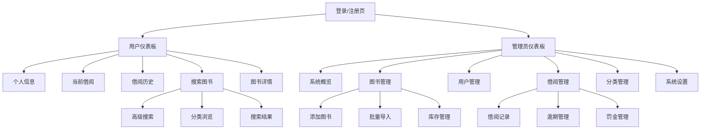
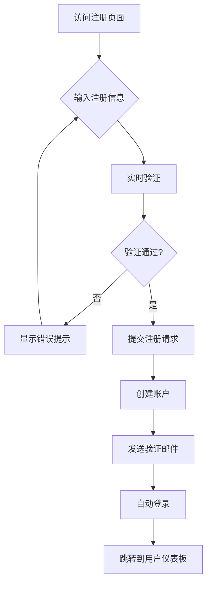
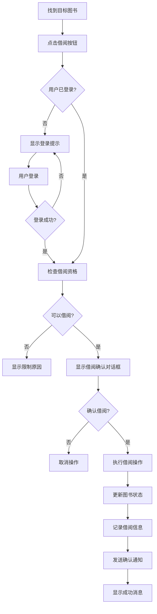
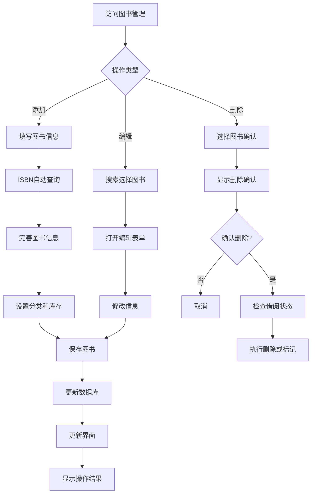

# 图书管理系统 UI/UX Specification

## Introduction

This document defines the user experience goals, information architecture, user flows, and visual design specifications for 图书管理系统's user interface. It serves as the foundation for visual design and frontend development, ensuring a cohesive and user-centered experience.

### Overall UX Goals & Principles

#### Target User Personas

- **图书管理员**: 专业图书管理工作者，需要高效的管理工具和数据洞察，重视工作效率和系统稳定性
- **普通用户**: 学生、教师和研究人员，期望简单直观的借阅体验，快速找到所需图书
- **系统管理员**: IT管理人员，需要完整的系统控制能力和安全配置选项

#### Usability Goals

- **易学性**: 新用户在5分钟内能完成核心任务（查找图书、借阅、还书）
- **使用效率**: 管理员常用操作可在3次点击内完成
- **错误预防**: 对破坏性操作提供明确的确认和验证
- **记忆性**: 间歇性用户无需重新学习即可使用系统
- **可访问性**: 符合WCAG AA标准，支持各类辅助技术
- **响应速度**: 所有交互响应时间小于200ms

#### Design Principles

1. **简洁优于复杂** - 优先考虑清晰的信息架构和直观的操作流程
2. **渐进式展示** - 只在需要时显示相关信息，避免信息过载
3. **一致的设计语言** - 在整个应用中使用统一的UI模式和交互方式
4. **即时反馈** - 每个操作都应有明确的即时响应
5. **默认可访问** - 从设计之初就考虑所有用户群体的需求
6. **数据驱动** - 重要决策基于用户行为数据和反馈

### Change Log

| Date | Version | Description | Author |
|------|---------|-------------|---------|
| 2025-12-09 | 1.0 | Initial UI/UX Specification | Sally (UX Expert) |

## Information Architecture (IA)

### Site Map / Screen Inventory

### Navigation Structure

**Primary Navigation:**
- 顶部导航栏：Logo、全局搜索、用户菜单（包含登录/登出）
- 侧边导航栏（管理员）：仪表板、图书管理、用户管理、借阅管理、报表统计、系统设置
- 面包屑导航：显示当前位置层级关系

**Secondary Navigation:**
- 标签页切换（如在图书管理中的列表/卡片视图）
- 快速操作按钮（添加、编辑、删除等）
- 筛选器和排序选项

**Breadcrumb Strategy:**
- 首页 > 一级模块 > 二级模块 > 具体页面
- 支持点击任意层级快速返回

## User Flows

### 用户注册流程

**User Goal:** 新用户创建账户以便使用系统

**Entry Points:** 首页登录按钮、直接访问注册页面

**Success Criteria:** 成功创建账户并自动登录，收到欢迎邮件

#### Flow Diagram

#### Edge Cases & Error Handling:
- 邮箱或用户名已存在：明确提示并提供登录链接
- 密码强度不足：实时显示密码强度要求
- 网络错误：保存表单数据，提示重试
- 验证邮件未收到：提供重新发送选项

#### Notes:
- 使用渐进式表单验证，减少用户挫折感
- 成功后自动创建默认用户偏好设置

### 图书借阅流程

**User Goal:** 用户成功借阅所需图书

**Entry Points:** 图书详情页、搜索结果页、快速搜索框

**Success Criteria:** 成功借阅图书，系统更新库存，确认通知发送

#### Flow Diagram

#### Edge Cases & Error Handling:
- 图书已借完：显示可预约选项
- 用户借阅数量超限：显示当前借阅和限制说明
- 用户信用分不足：显示影响和解决方法
- 系统错误：保留操作状态，提供重试机制

#### Notes:
- 考虑添加"预约"功能，当图书不可用时
- 借阅成功后推荐相关图书

### 图书管理流程

**User Goal:** 管理员有效管理图书库存和分类

**Entry Points:** 管理员仪表板、图书管理菜单

**Success Criteria:** 准确添加/更新/删除图书信息，保持库存准确

#### Flow Diagram

#### Edge Cases & Error Handling:
- ISBN重复：提示是否更新现有记录
- 删除已被借阅的图书：禁止或提供转移选项
- 批量导入失败：提供错误报告和修正建议
- 图片上传失败：提供备用方案

#### Notes:
- 支持批量操作提高效率
- 考虑集成图书数据库API自动填充信息

## Wireframes & Mockups

**Primary Design Files:** [待创建的Figma链接]

### Key Screen Layouts

#### 登录/注册页面

**Purpose:** 提供简洁安全的用户认证入口

**Key Elements:**
- 左侧：系统介绍和特色功能展示
- 右侧：登录/注册表单切换
- 顶部：Logo和系统名称
- 底部：帮助链接和联系方式

**Interaction Notes:**
- 表单验证实时反馈
- 密码强度指示器
- 记住登录状态选项
- 社交登录可选（如需要）

**Design File Reference:** [Login/Register Screen Frame]

#### 管理员仪表板

**Purpose:** 提供系统整体概览和快速访问常用功能

**Key Elements:**
- 顶部：搜索栏、通知中心、用户菜单
- 侧边：主导航菜单
- 中心：关键指标卡片（今日借阅、逾期统计、库存警告等）
- 快速操作：添加图书、用户管理、借阅记录
- 图表展示：借阅趋势、热门图书等

**Interaction Notes:**
- 卡片可点击跳转到详细页面
- 支持自定义仪表板布局
- 实时数据更新
- 响应式网格布局

**Design File Reference:** [Admin Dashboard Frame]

#### 图书管理页面

**Purpose:** 高效管理图书库存和信息

**Key Elements:**
- 工具栏：搜索、筛选、批量操作、视图切换
- 表格/卡片视图：图书列表展示
- 分页：支持大数据量浏览
- 快速操作：编辑、删除、查看详情
- 状态指示：库存状态、借阅状态

**Interaction Notes:**
- 支持拖拽排序
- 批量选择和操作
- 内联编辑功能
- 高级筛选器

**Design File Reference:** [Book Management Frame]

## Component Library / Design System

**Design System Approach:** 基于Element Plus组件库进行定制，确保一致的设计语言和开发效率

### Core Components

#### Button 按钮组件

**Purpose:** 触发操作和导航的交互元素

**Variants:**
- Primary：主要操作（蓝色背景）
- Default：次要操作（白色背景）
- Danger：危险操作（红色背景）
- Text：文本按钮（无背景）
- Link：链接样式（下划线）

**States:**
- Default（默认）
- Hover（悬停）
- Active（按下）
- Disabled（禁用）
- Loading（加载中）

**Usage Guidelines:**
- 一个页面只使用一个主要按钮
- 危险操作需要二次确认
- 按钮文字清晰表达操作结果

#### Form 表单组件

**Purpose:** 收集和验证用户输入

**Variants:**
- 垂直表单：标准布局
- 水平表单：紧凑布局
- 内联表单：搜索等简单场景

**States:**
- Normal：正常输入
- Error：验证错误
- Warning：警告提示
- Success：验证成功
- Disabled：禁用状态

**Usage Guidelines:**
- 所有必填项明确标注
- 实时验证减少提交错误
- 错误信息具体且有助解决

#### Table 表格组件

**Purpose:** 展示结构化数据

**Variants:**
- 基础表格：简单数据展示
- 带选择：支持批量操作
- 带排序：支持列排序
- 带筛选：支持数据筛选

**States:**
- Loading：加载状态
- Empty：空数据状态
- Error：错误状态

**Usage Guidelines:**
- 合理使用固定列宽
- 提供足够的行间距
- 支持键盘导航

#### Modal 模态框组件

**Purpose:** 需要用户确认或输入的重要操作

**Variants:**
- Confirm：确认对话框
- Form：表单模态框
- Info：信息展示
- Custom：自定义内容

**States:**
- Open：打开状态
- Close：关闭状态
- Loading：操作中

**Usage Guidelines:**
- 明确的操作意图说明
- 提供取消选项
- 避免嵌套模态框

## Branding & Style Guide

**Brand Guidelines:** 待定的品牌规范文档

### Color Palette

| Color Type | Hex Code | Usage |
|------------|----------|-------|
| Primary | #1E3A8A | 导航栏、链接、主要按钮 |
| Secondary | #3B82F6 | 次要按钮、标签、图标 |
| Accent | #10B981 | 成功状态、完成标记 |
| Success | #10B981 | 成功反馈、可用状态 |
| Warning | #F59E0B | 警告信息、待处理 |
| Error | #EF4444 | 错误提示、危险操作 |
| Neutral | #6B7280 | 辅助文字、边框线 |

### Typography

#### Font Families
- **Primary:** -apple-system, BlinkMacSystemFont, "Segoe UI", Roboto, sans-serif
- **Secondary:** "PingFang SC", "Microsoft YaHei", sans-serif（中文）
- **Monospace:** "SF Mono", Monaco, "Cascadia Code", monospace

#### Type Scale

| Element | Size | Weight | Line Height |
|---------|------|--------|-------------|
| H1 | 32px | 600 | 1.2 |
| H2 | 24px | 600 | 1.3 |
| H3 | 20px | 600 | 1.4 |
| Body | 16px | 400 | 1.5 |
| Small | 14px | 400 | 1.4 |

### Iconography

**Icon Library:** Element Plus Icons + 自定义补充图标

**Usage Guidelines:**
- 使用统一的线性风格
- 图标大小：16px（小）、20px（中）、24px（大）
- 保持2px描边粗细
- 图标含义清晰直观

### Spacing & Layout

**Grid System:** 基于24px基础网格，使用Flexbox和CSS Grid布局

**Spacing Scale:**
- XS: 4px - 极小间距
- SM: 8px - 小间距
- MD: 16px - 标准间距
- LG: 24px - 大间距
- XL: 32px - 很大间距
- XXL: 48px - 极大间距

## Accessibility Requirements

### Compliance Target

**Standard:** WCAG 2.1 AA Level

### Key Requirements

**Visual:**
- Color contrast ratios: Normal text 4.5:1, Large text 3:1
- Focus indicators: 2px solid outline with high contrast
- Text sizing: Support 200% zoom without horizontal scrolling

**Interaction:**
- Keyboard navigation: Full keyboard access to all functionality
- Screen reader support: Proper ARIA labels and landmarks
- Touch targets: Minimum 44x44px for touch interfaces

**Content:**
- Alternative text: All meaningful images have descriptive alt text
- Heading structure: Logical heading hierarchy (h1-h6)
- Form labels: All form inputs have associated labels

### Testing Strategy

- Automated testing: axe-core for code scanning
- Manual testing: Keyboard navigation and screen reader testing
- User testing: Include users with disabilities in testing sessions
- Regular audits: Quarterly accessibility audits

## Responsiveness Strategy

### Breakpoints

| Breakpoint | Min Width | Max Width | Target Devices |
|------------|-----------|-----------|----------------|
| Mobile | 320px | 767px | iPhone, Android phones |
| Tablet | 768px | 1023px | iPad, Android tablets |
| Desktop | 1024px | 1439px | Laptops, Desktop monitors |
| Wide | 1440px | - | Large desktop displays |

### Adaptation Patterns

**Layout Changes:**
- Mobile: Single column layout, collapsible navigation
- Tablet: Two-column layout, sidebar navigation
- Desktop: Multi-column layout, persistent sidebar
- Wide: Enhanced spacing, additional information panels

**Navigation Changes:**
- Mobile: Bottom tab bar, hamburger menu
- Tablet: Top navigation with dropdown menus
- Desktop: Full horizontal navigation with submenus

**Content Priority:**
- Mobile: Essential actions first, hide secondary information
- Tablet: Balance of primary and secondary content
- Desktop: Full content exposure with clear hierarchy

**Interaction Changes:**
- Mobile: Touch-optimized targets, swipe gestures
- Tablet: Touch and hover support
- Desktop: Full mouse interactions, keyboard shortcuts

## Animation & Micro-interactions

### Motion Principles

- **功能性**：动画必须有明确目的，不干扰用户任务
- **快速响应**：动画时长控制在200-500ms之间
- **自然流畅**：使用缓动函数模拟真实物理效果
- **可预测性**：保持一致的动画模式和方向

### Key Animations

- **页面过渡**: Fade-in + Slide-up (Duration: 300ms, Easing: ease-out)
- **模态框**: Scale-in + Fade-in (Duration: 250ms, Easing: ease-out)
- **列表项**: Staggered Slide-in (Duration: 200ms per item, Easing: ease-out)
- **加载动画**: Spin (Duration: 1000ms infinite, Easing: linear)
- **悬停效果**: Transform scale(1.02) (Duration: 150ms, Easing: ease-in-out)
- **点击反馈**: Transform scale(0.98) (Duration: 100ms, Easing: ease-in-out)
- **数据更新**: Background color pulse (Duration: 600ms, Easing: ease-in-out)

## Performance Considerations

### Performance Goals

- **Page Load**: 首页加载时间 < 2秒
- **Interaction Response**: 交互响应时间 < 100ms
- **Animation FPS**: 动画帧率保持 60fps

### Design Strategies

- 使用CSS transform和opacity属性实现动画
- 图片懒加载和适当压缩
- 避免过度使用阴影和模糊效果
- 使用SVG图标代替位图
- 实施代码分割和按需加载
- 合理使用缓存策略

## Next Steps

### Immediate Actions

1. 创建Figma设计文件，基于此规范设计详细界面
2. 建立组件库，实现设计系统组件
3. 进行用户测试，验证设计决策
4. 与开发团队协作，确保技术可行性
5. 制定设计交付规范和文档

### Design Handoff Checklist

- [x] All user flows documented
- [x] Component inventory complete
- [x] Accessibility requirements defined
- [x] Responsive strategy clear
- [x] Brand guidelines incorporated
- [x] Performance goals established
- [ ] Interactive prototypes created
- [ ] Usability testing completed
- [ ] Development handoff documentation prepared

## Checklist Results

[待执行UI/UX checklist后填充结果]